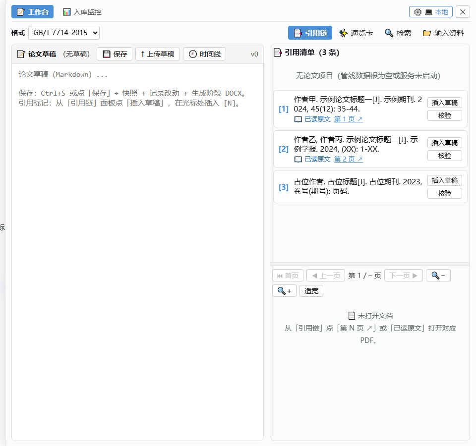
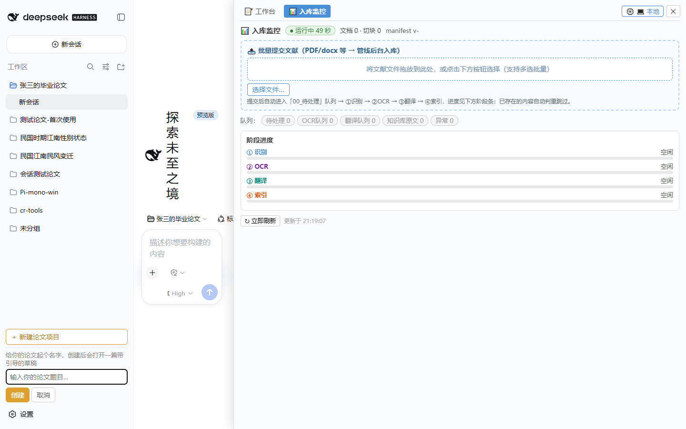
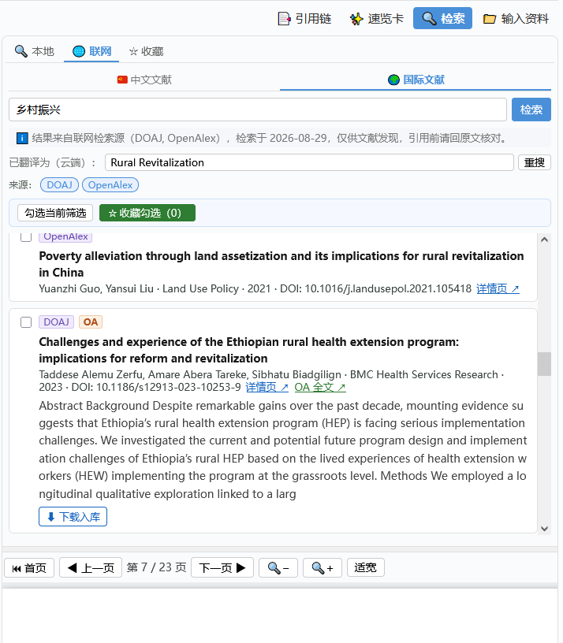
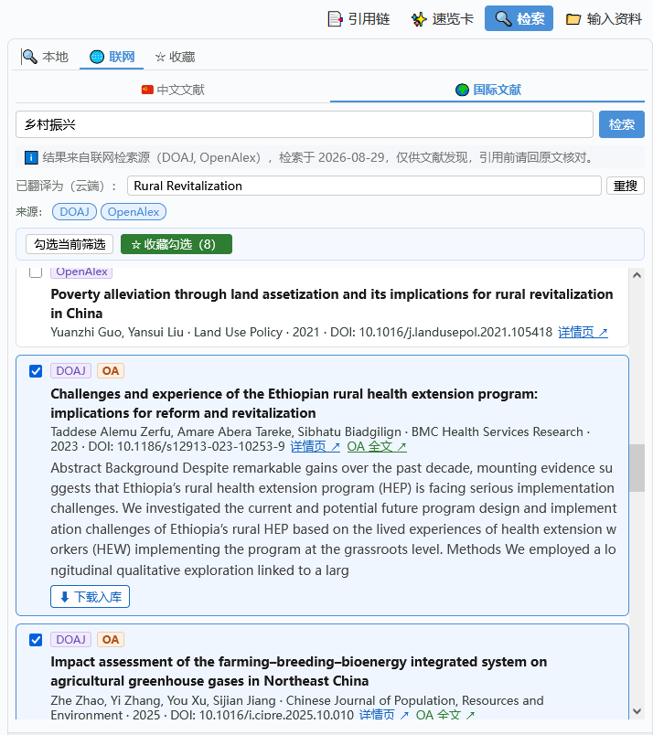
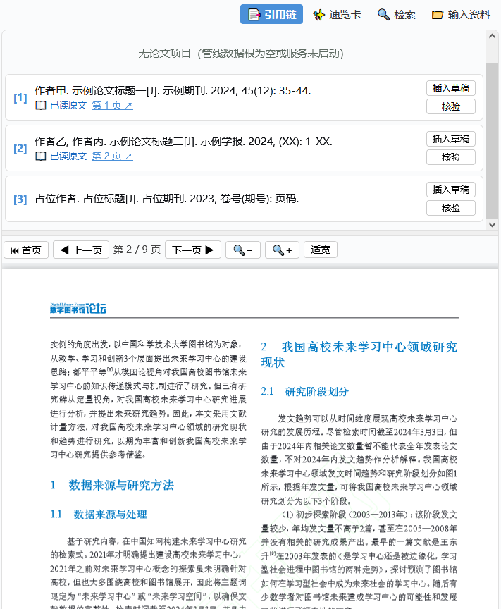
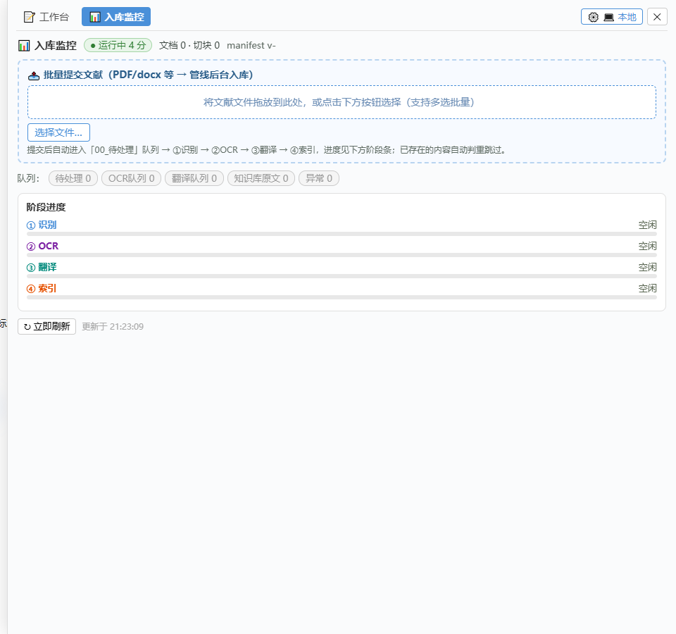
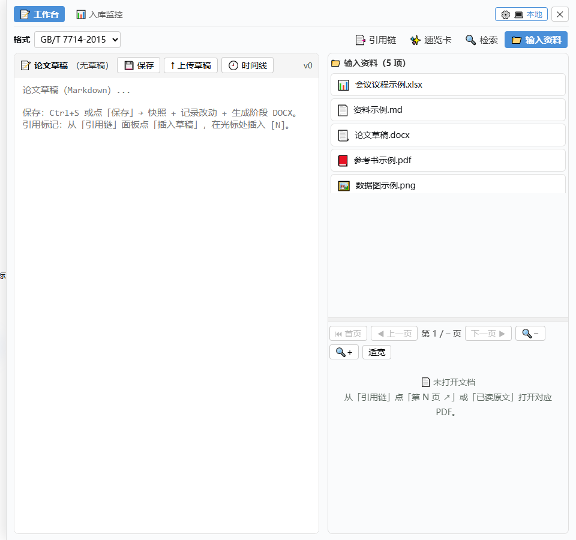
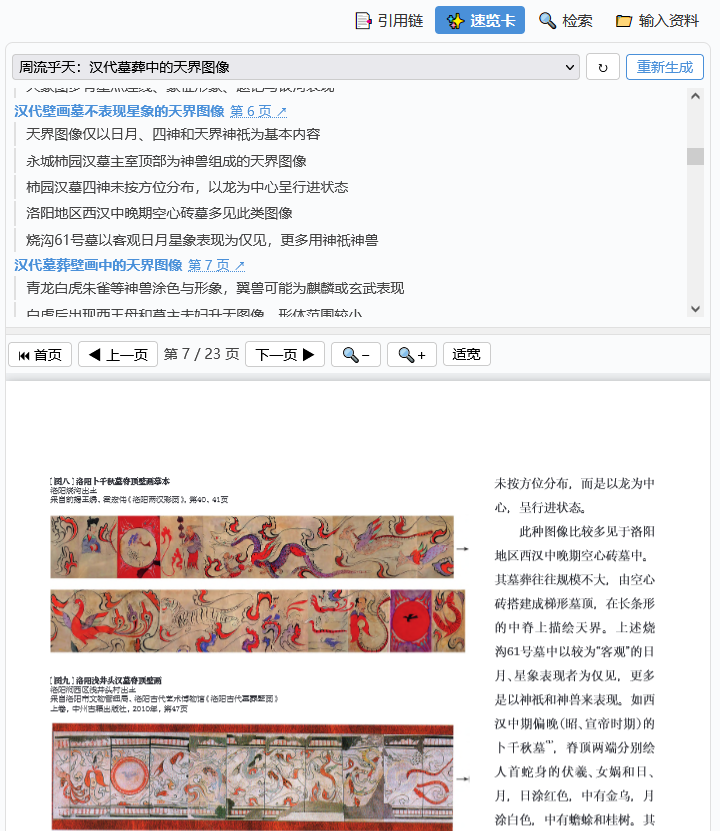

# cr-tools 使用手册

> 面向使用者（人文社科大学生，非程序员）。本文档教你用论文工作台完成：**读文献 → 引用 → 写草稿 → 与 AI 讨论 → 交付 DOCX** 的完整流程。
> 核心设计理念：**降低正常引用的操作工作量**——能一步完成的事，绝不让你做两步。

## 一、快速上手：30 秒认识工作台

打开浏览器访问 `http://127.0.0.1:3180`（便携包双击 `start.bat` 后自动打开），你会看到：

```
┌─────────────────────────────────────────────┐
│ 顶栏：📚 论文工作台（打开/收起） · ⚙️ 后端切换  │
├──────────────┬──────────────────────────────┤
│  对话区 1/3   │     工作台面板 2/3            │
│  （输入框在   │   Tab：工作台 | 入库监控        │
│   最下方）    │   工作台内：草稿 | 文献工作台    │
│              │     └ 引用链|速览卡|检索|输入资料 │
│              │   下方：PDF 预览（可拖拽）        │
└──────────────┴──────────────────────────────┘
```

- **左边**：和 AI 聊天的对话区（输入框在最下方）
- **右边**：工作台面板——论文工作全在这（草稿、引用链、速览卡、检索、输入资料、PDF 预览）
- **两个 Tab**：工作台（写作）｜入库监控（文献入库进度）

> 📷 **工作台总览**（下图即你打开后的界面）：



### 🆕 新建论文项目

**左侧栏底部点「＋ 新建论文项目」**，输入论文题目即可：

| 步骤 | 操作 | 结果 |
|---|---|---|
| 1 | 左侧栏底部「＋ 新建论文项目」 | 弹出输入框 |
| 2 | 输入论文题目 → 确定 | **自动建好一个论文工作区**（左侧栏出现）+ 空模板草稿 |
| 3 | 左侧点这个论文工作区 → 新会话 | 工作台自动弹出，显示该篇论文的空模板草稿 |

> **一篇论文 = 一个论文工作区**：新建即建好专属工作区，引用清单、草稿、版本记录都在这，多篇论文互不干扰（左侧栏可建多个，各自独立）。**空模板草稿**已含工作台快速上手 + 排版说明，照着写即可。

> 📷 **新建论文项目**（左侧栏底部「＋ 新建论文项目」，点开后如下）：



- **其他方式**：项目也可来自便携包预置（`papers/` 目录下），或上传已有草稿（见下方「导入已有草稿」）。

**第一次使用先做**：在 `pipeline/config.yaml` 填入 API Key（见安装手册 §四）——不填也能用，只是"云端分析/联网检索"会降级。

---

## 二、核心功能：引用操作全流程

> **什么是引用登记？** 写论文时引用别人的观点，需要标注来源（作者/文献/页码），并在文末列出参考文献。工作台帮你自动完成：选中文字 → 确认 → 自动编号 `[1]` → 自动进引用清单。**你只管读和选，编号和清单交给它。**

### 场景一：写论文时引用（推荐，最常用）

**适用**：在草稿里写正文，引用 PDF 里的一段话。

| 步骤 | 操作 | 结果 |
|---|---|---|
| 1 | 打开 PDF 预览（速览卡点文档 → 点章节页码，或检索结果点「打开预览」） | PDF 显示在工作台下方 |
| 2 | **鼠标拖选**你要引用的一段话（文字变蓝）→ 松开 | 自动记录来源（哪篇文献第几页） |
| 3 | 到草稿编辑框 **Ctrl+V 粘贴** | 弹出小卡片：「📎 是否确认引用？」（显示来源标题/页码/片段） |
| 4 | 点「**确认引用**」 | 文字落入草稿，段尾自动出现 `[1]`，引用清单自动登记 |
| — | （点「仅粘贴」则只粘文字，不登记） | 不产生引用编号 |

**省了什么功夫**：不用手打来源、不用手写编号、不用手动维护参考文献列表——三步完成，引用清单自动更新。

### 场景二：与 AI 讨论时引用

**适用**：在对话区和 AI 讨论某篇文献的观点，让 AI 知道你引用了哪篇哪页。

| 步骤 | 操作 | 结果 |
|---|---|---|
| 1 | PDF 预览中**拖选**一段话（文字变蓝） | 左栏输入框上方出现蓝色 chip：「📎 来源 《标题》· 第 N 页」 |
| 2 | 点 chip 上的「**插入**」 | 引用内容自动填入输入框（含来源标注，可再编辑） |
| 3 | 在输入框补充你的问题 → 发送 | AI 结合你引用的文献内容回答 |
| — | chip 上的「✕」可随时移除 | 不想要就删掉 |

**省了什么功夫**：不用手打"根据《××》第几页……"，AI 能看到引用来源，回答更有依据。

### 场景三：检索文献并引用

**适用**：还没读具体 PDF，先通过检索找到相关文献。

| 步骤 | 操作 | 结果 |
|---|---|---|
| 1 | 工作台 → 文献工作台 → **检索** Tab | 本地检索（知识库）/ 联网检索（中文/国际） |
| 2 | 输入关键词 → 搜索（可切换中文/国际标签、筛选来源） | 结果列表（标题/摘要/来源） |
| 3 | 点「☆ 收藏勾选」或结果上的登记按钮 | 收藏进清单 / 直接登记引用 |
| 4 | 收藏清单可导出 CSV（复制引用信息） | 文献管理 |

**省了什么功夫**：检索→收藏→导出一步到位，OA 文献可直接「下载入库」进知识库。

> 📷 **检索面板**（本地 / 联网 / 收藏三标签）：



**🔖 勾选收藏 → 导出表格**：在检索结果前**勾选**想留的文献（多选），点「⭐ 收藏勾选」进收藏清单；收藏清单可**导出 CSV / 复制引用信息**，方便你**通过其他渠道（如文献管理工具、Excel、笔记）进一步搜集整理**。

> 📷 **检索结果收藏**（勾选多篇 → 收藏勾选 → 可导出表格）：



### 场景四：引用链面板（管理你的引用）

工作台 → 文献工作台 → **引用链** Tab：

- **清单**：所有已登记引用（编号/来源/页码/片段），重复引用自动复用同一编号
- **插入草稿**：在草稿编辑器光标处点「插入引用标记」→ 插入 `[N]`
- **核验**：一键核验引用真实性（置信度提示）
- **导出**：按格式生成参考文献列表（配合 DOCX 交付）

**省了什么功夫**：参考文献列表全程自动维护，不重复登记，编号不乱。

> 📷 **引用链面板**：



---

## 三、与 AI 协作写论文

### 场景五：与 AI 讨论论文方向

**适用**：开题/写作迷茫时，让 AI 结合文献给方向建议。

| 步骤 | 操作 |
|---|---|
| 1 | 先把相关文献读起来（速览卡看摘要，或检索定位） |
| 2 | 在对话区提问，例如：*"我打算写档案与文化产业的结合方向，已有这些文献（引用），帮我梳理研究缺口和可切入的角度"* |
| 3 | 需要引用具体文献时，用**场景二**的 chip 把来源带给 AI |
| 4 | AI 的回答会结合你引用的文献内容（标注引用来源） |

**提示**：讨论方向时建议先用速览卡/检索了解领域概貌，再带着具体问题 + 引用去问，AI 的回答更有针对性。

### 场景六：让 AI 点评草稿

**适用**：草稿初稿完成，让 AI 帮忙找问题、给修改建议。

| 步骤 | 操作 |
|---|---|
| 1 | 在草稿编辑器写/保存你的内容（Ctrl+S 保存 → 自动快照 + 生成阶段 DOCX） |
| 2 | 把草稿发给 AI：复制草稿内容到对话区发送（或分段发，注明"请点评这段"） |
| 3 | 提问模板：*"请点评这段论述：结构是否清晰？论证是否充分？引用是否恰当？给出修改建议。"* |
| 4 | 根据建议修改 → 再保存（时间线自动记录每次版本，可回溯） |

**配套功能**：
- **时间线**：草稿框顶部「🕘 时间线」查看每次保存的版本，改坏了可找回
- **疑似引用建议**：保存草稿后自动扫描"疑似该引用的段落"，建议面板提示你确认登记 `[N]`（对齐引用清单）——写作时忘了登记，它帮你提醒

**省了什么功夫**：AI 点评 + 版本时间线 + 自动引用扫描，形成"写→评→改"闭环。

### 📄 导入已有草稿（.docx / .md）

如果你已经有一份旧草稿（Word 或 Markdown），不用手动搬进来——草稿编辑器顶部点「**↑ 上传草稿**」，选文件即可：

1. **替换当前草稿**：上传的 docx/md 内容**直接替换**草稿编辑器里的内容（不是新建一份），以后这份草稿就继续在当前工作台里维护，引用链跟着它走——避免"好几个草稿分不清引用哪些"。
2. **自动生成版本记录**：上传后把草稿快照存为一个新版本（时间线可查），替换的是内容、留得住版本。
3. **排版说明**：上传的 **Word（.docx）会自动转换成 Markdown**（正文结构、分段、小标题基本保留）。

> ⚠️ **排版简化**：目前草稿阶段以 Markdown 写作/存储为主，**复杂排版**（如页眉页脚、目录自动编号、特定页边距、分栏等）**不在当前版本范围**，我们安排在**下一步功能拓展**中完善。如果你上传的 docx 含复杂排版，转换后可能有简化——建议在最终交付前用**「导出 DOCX」**生成正式文档再手动微调格式。
>
> 你只需要：**专注写好正文 + 引用 + 结构**，排版留给交付阶段。

### 场景七：让 AI 帮你想检索关键词（中英双语）

**适用**：有研究论点，但不知道用什么关键词检索文献；或中文检索结果太少，想用英文关键词搜国际文献。

| 步骤 | 操作 |
|---|---|
| 1 | 对话区输入你的**论点/研究问题**，例如：*"我想研究'数字乡村建设对农民收入的影响'，帮我列出检索用的关键词，中英文各一组，包含同义词。"* |
| 2 | AI 给出**中英文关键词组**（含同义词/学术变体，如：digital village / rural digitalization / farmers' income） |
| 3 | 到**检索**面板用建议的关键词搜索：<br>· 中文关键词 → 本地/中文检索<br>· 英文关键词 → 切「国际」标签搜国际文献 |
| 4 | 可继续让 AI 细化（*"加一个地域限定词"* / *"换成更学术的表达"*）再搜 |

**配套能力（检索面板自带）**：
- **中文自动英译**：在检索框输入中文查询，联网检索会自动生成英文查询（queryEn）联合搜索，中英文结果一起返回
- **翻译可见可改**：自动生成的英文翻译显示在结果上方，可手动修改后「重新搜索」

**省了什么功夫**：不用自己绞尽脑汁想关键词、不用手动翻译成英文——论点交给 AI，关键词（含英文版）直接进检索。

---

## 四、引用编号规则（读这一节就懂 [N]）

- 每篇文献**第一次**登记获得一个编号 `[1]`、`[2]`……
- **重复引用同一文献**：自动复用原编号（不重复登记），提示"已复用"
- `[N]` 与引用清单一一对应，导出参考文献时自动按编号排列
- 引用登记失败（网络/超时）**不会丢你的文字**：原文自动落回草稿

## 五、文献入库（把资料收进知识库）

### 方式 1：批量上传
工作台 → **入库监控** Tab →「📤 批量提交文献」：拖拽/多选 PDF、docx、md 等 → 自动后台入库（重复文件自动判重跳过）→ 监控 Tab 实时显示进度（①识别 → ②OCR → ③翻译 → ④索引）。

> 📷 **入库监控**（批量提交 + 四阶段进度）：



### 方式 2：输入资料索引
工作台 → 文献工作台 → **输入资料**：项目携带的资料（PDF/docx/图片）→ 选中文档 → 点「🔍 索引」→ 入库。列表上会显示 **⏳ 入库中 / ✅ 已入库** 徽标（10 秒自动刷新）。

> 📷 **输入资料**（项目资料索引）：



> 扫描件 PDF（无文字层）会自动走 OCR 识别；图片/表格类资料当前只支持预览，不入库（见安装手册 FAQ）。

> 📷 **速览卡**（文档 AI 摘要）：



## 六、常用功能速查

| 功能 | 入口 | 说明 |
|---|---|---|
| 速览卡 | 文献工作台 → 速览卡 | 文档 AI 摘要，章节页码可点击跳转 PDF |
| PDF 预览 | 点文档/检索结果「打开预览」 | 翻页/缩放/适宽/选区复制 |
| 后端切换 | 顶栏 ⚙️ | 本地（LLM 本地跑）/ 云端（DeepSeek）/ 完全本地 |
| 草稿 | 工作台 → 草稿 | Markdown 写作 + 保存快照 + 时间线 + DOCX 生成 |
| 入库监控 | 一级 Tab → 入库监控 | 队列徽标 + 四阶段进度 + 批量提交 |

## 七、常见问题

**Q：复制文字后没弹确认卡片 / 没出现 chip？**
A：确认你是在 **PDF 预览的文字层**上拖选（文字变蓝），且复制的是 ≥5 字的段落；10 分钟内有效（过期需重新拖选）。

**Q：引用清单里编号乱了？**
A：编号由系统自动管理，重复引用会复用——清单以引用链面板显示为准。

**Q：检索结果 score 都很低？**
A：语义检索的相似度分数绝对值偏低是正常现象（BGE-M3 特性），**看排序不看分数**，排在前面的就是最相关的。

**Q：提交的 PDF 一直停在 OCR？**
A：扫描件 OCR 较慢（复杂版面每页可达 1-2 分钟）；超过 30 分钟无进展会由系统自动处理（超时跳过该页并标注，不阻塞整篇入库）。

**Q：云端的 Key 填在哪？**
A：`pipeline/config.yaml` → `models.llm.cloud.api_key`（申请见安装手册 §四）。

---

*手册版本：v0.1（2026-08-17）。引用操作流程为产品核心，功能设计围绕"降低操作工作量"持续迭代。*
